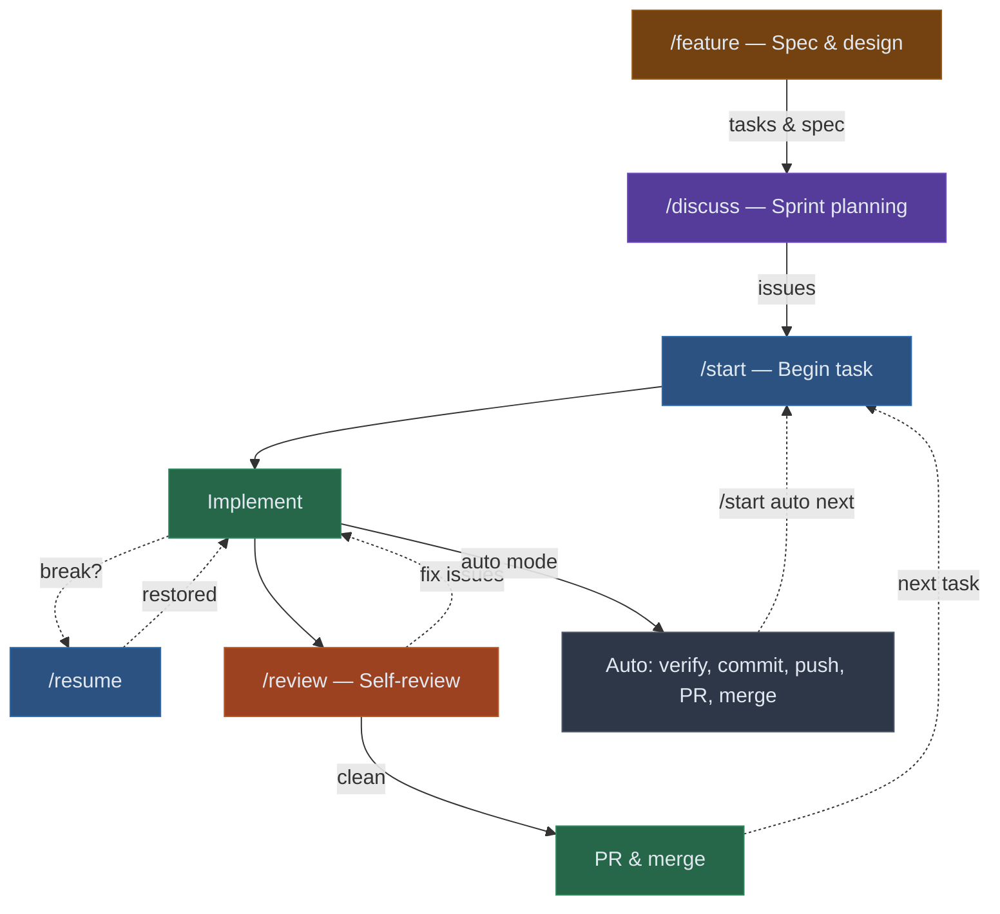

# Agentic Bootstrap

A global [Claude Code](https://docs.anthropic.com/en/docs/claude-code) command that generates a complete AI-assisted development workflow for any project. Run `/bootstrap` once to get six slash commands, utility scripts, and a workflow configuration tailored to your codebase.

## Quick Start

```bash
# Install the /bootstrap command
npx @studiomopoke/agentic-bootstrap install

# Open any project in Claude Code and run it
cd your-project && claude
> /bootstrap
```

Bootstrap walks through seven phases — task management, git conventions, codebase analysis, agent zones, planning structure, artifact generation, and verification — then you're ready to go.

## What You Get

| Command | Purpose |
|---------|---------|
| `/feature` | Specify **what** to build — interactive discovery, spec, technical design, scope |
| `/discuss` | Plan **when/how** — sprint planning, task scheduling, backlog management |
| `/start` | Begin a task — fetch context, create branch, spawn zone agents |
| `/resume` | Continue after a break — reconstruct context from git, issues, and planning docs |
| `/review` | Pre-PR self-review — evaluate changes against requirements and AC |
| `/sync` | Pull latest and rebase — smart conflict resolution, safe defaults |

**Auto mode:** `/start auto next` runs the full cycle autonomously — implement, verify, commit, push, create PR, and merge.

### Generated Artifacts

- **Slash commands** in `.claude/commands/` — the six commands above, customised to your project
- **Workflow config** appended to `CLAUDE.md` — zone definitions, conventions, provider config
- **Permissions** in `.claude/settings.json` — safe defaults for agentic operation
- **Utility scripts** in `scripts/` (GitHub Issues only) — issue management, next-task selection, project board ops, `--app-token` auth
- **Planning scaffold** in `planning/` (optional) — sprint directories, feature specs, task specs, TDD specs
- **Git hygiene** — `.gitignore` and `.gitattributes` with stack-appropriate defaults

## How It Works



**Sessions are disposable.** All state lives in git, the issue tracker, and planning docs — never in the conversation. `/resume` reconstructs full context from these durable stores.

**Agents explore in parallel.** During bootstrap you define zones (areas of your codebase). Commands spawn zone-specific agents concurrently, keeping the main context focused while grounding decisions in real code.

## Agent Zones

Zones map your codebase to distinct concerns (3-6 for most projects). Each command spawns only the relevant zones.

| Field | Example |
|-------|---------|
| **Name** | "API Surface" |
| **Paths** | `src/api/`, `src/routes/` |
| **Triggers** | "API changes, new endpoints" |
| **Dependencies** | "Calls payments API via `src/clients/payments.ts`" |

## Planning Modes

| Mode | Best for | What `/discuss` creates |
|------|----------|------------------------|
| **Full** | Greenfield projects | Sprint dirs, task specs with AC, TDD specs, backlog |
| **Task-level** | Established codebases | Per-task planning doc with context and approach |
| **None** | Quick fixes | No local docs — relies on issue tracker |

## Supported Providers

| Provider | Support | Notes |
|----------|---------|-------|
| **GitHub Issues** | Full | Auto mode, project boards, utility scripts, `--app-token` auth |
| **Jira** | Basic | Task fetch and status transitions via Atlassian MCP or CLI |
| **Linear** | Basic | Task fetch and status transitions via Linear MCP or CLI |
| **Asana** | Basic | Task fetch and status transitions via Asana MCP or CLI |
| **None** | Manual | Manual task descriptions, no integrations |

## GitHub App Integration (Optional)

All generated utility scripts accept an `--app-token` flag for GitHub App authentication, providing a separate API rate limit pool — useful for CI/CD and bulk operations.

If you don't have a GitHub App yet, the scripts work fine with your default `gh` CLI auth. When you pass `--app-token` without one configured, you'll get setup instructions:

```
--app-token: GitHub App not configured. To enable:
  1. Create a GitHub App at https://github.com/settings/apps
  2. Grant it repo/project permissions and install on your org
  3. Download the private key (.pem) into this repo
     (*.pem is already in .gitignore — never commit private keys!)
  4. pip install pyjwt cryptography
  5. Re-run /bootstrap and say yes to 'GitHub App integration'
  Falling back to default gh CLI auth.
```

## Usage Examples

```bash
# Spec a feature
> /feature payment processing

# Plan a sprint
> /discuss next sprint

# Work on a task
> /start #42
> /start next              # auto-select next unstarted issue

# Autonomous mode
> /start auto next         # implement → verify → commit → push → PR → merge

# Resume after a break
> /resume

# Self-review before PR
> /review

# Sync with upstream
> /sync
```

## Installation

```bash
# Install
npx @studiomopoke/agentic-bootstrap install

# Update
npx @studiomopoke/agentic-bootstrap@latest update

# Uninstall
npx @studiomopoke/agentic-bootstrap uninstall
```

Or manually: download `bootstrap.md` to `~/.claude/commands/bootstrap.md`.

Re-running `/bootstrap` is safe — it detects existing artifacts and updates rather than duplicates.

## License

MIT — see [LICENSE](LICENSE).
