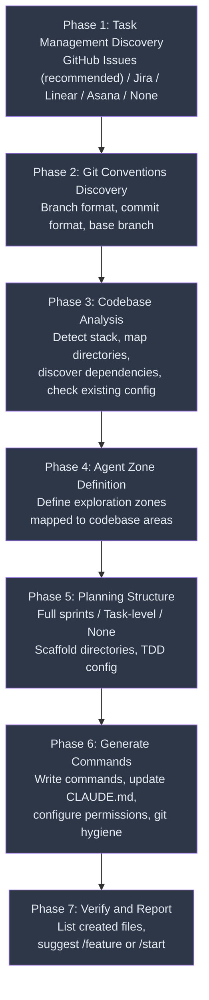
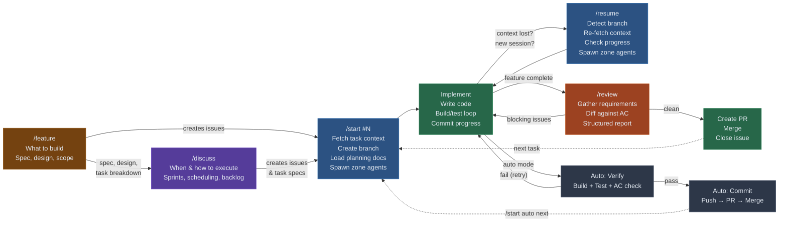
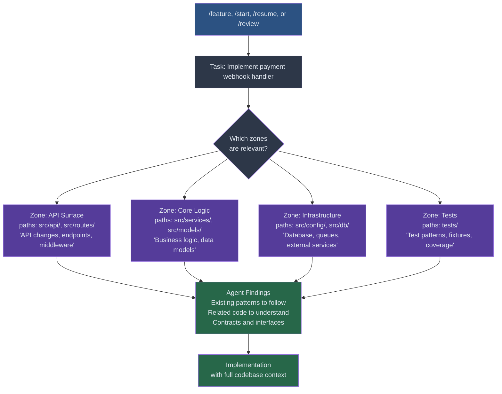

# Agentic Bootstrap

A global [Claude Code](https://docs.anthropic.com/en/docs/claude-code) skill that generates a complete AI-assisted development workflow for any project. Run `/bootstrap` once to configure task management, planning infrastructure, and five slash commands that drive a repeatable plan-build-test-ship cycle.

## Overview

`/bootstrap` interviews you about your project — task management provider, git conventions, codebase structure, planning preferences — then generates a set of project-specific slash commands and configuration that turn Claude Code into a context-aware development agent.

**Generated artifacts:**

| Artifact | Path | Purpose |
|----------|------|---------|
| `/feature` command | `.claude/commands/feature.md` | Specify **what** to build — feature spec, design, scope |
| `/discuss` command | `.claude/commands/discuss.md` | Plan **when/how** to execute — sprints, scheduling, backlog |
| `/start` command | `.claude/commands/start.md` | Begin work on a task (supports auto mode) |
| `/resume` command | `.claude/commands/resume.md` | Continue after context loss |
| `/review` command | `.claude/commands/review.md` | Pre-PR self-review |
| Workflow config | `CLAUDE.md` (appended section) | Zone definitions, conventions, provider config |
| Permissions | `.claude/settings.json` | Safe defaults for agentic operation |
| Utility scripts | `scripts/issue.py`, `scripts/next-issue.py`, `scripts/project.py` | GitHub issue management, next-task selection, project board ops (GitHub Issues only) |
| Planning scaffold | `planning/` (optional) | Sprint directories, task specs, TDD specs |
| Git hygiene | `.gitignore`, `.gitattributes` | Stack-appropriate defaults |

## Architecture

The system has three layers. Each builds on the one below.


**Layer 1 — Bootstrap** configures the project once. **Layer 2 — Commands** orchestrate daily development. **Layer 3 — Infrastructure** provides the durable state (issues, planning docs, git history) that commands read and write.

## Bootstrap Phases

When you run `/bootstrap`, it walks through seven phases to tailor the workflow to your project.



### Phase details

| Phase | What it does | Key decisions |
|-------|-------------|---------------|
| **1. Task Management Discovery** | Discovers your issue tracker and how to connect to it | Provider choice (GitHub Issues recommended), connection details, GitHub Projects integration, MCP vs CLI fallback |
| **2. Git Conventions Discovery** | Captures branching and commit standards | Branch prefix format, commit message format, base branch detection, AI marker preference |
| **3. Codebase Analysis** | Explores the repo to understand its structure | Stack detection, build/test command detection, key directories, external services/APIs, sibling repos, checks for existing CLAUDE.md and commands |
| **4. Agent Zone Definition** | Defines parallel exploration agents mapped to codebase areas | Zone names, paths, triggers, integration boundaries (see [Agent Zones](#agent-zones)) |
| **5. Planning Structure** | Chooses planning depth and scaffolds directories | Full sprints vs task-level vs none, TDD integration, sprint naming (see [Planning & TDD](#planning--tdd-flow)) |
| **6. Generate Commands** | Writes all artifacts to the project | Slash commands, CLAUDE.md config, permissions, utility scripts (GitHub Issues), `.gitignore`/`.gitattributes`/LFS |
| **7. Verify and Report** | Confirms setup and suggests first task | Lists created files, summarizes commands, proposes `/feature` or `/start {TASK_ID}` |

Re-running `/bootstrap` is safe — it detects existing artifacts and replaces the workflow config section in CLAUDE.md rather than duplicating it.

## Task Lifecycle

The five generated commands form a lifecycle. Features flow from specification through planning and implementation to review.



### What each command does

**`/feature`** — Specify **what** to build. Runs an interactive discovery process grounded in codebase exploration:
1. Spawns zone agents to understand what exists — relevant systems, patterns, dependencies, reference implementations
2. Walks through structured Q&A: problem/purpose, scope/MVP, behaviour/AC, dependencies, technical approach, testing strategy, risks
3. Keeps iterating until requirements and dependencies are fully fleshed out — summarizes after each section, asks what's missing
4. Produces three documents in `planning/features/{name}/`: `spec.md` (what and why), `technical-design.md` (how), `scope.md` (phases, task breakdown, testing)
5. Offers to create issues from the task breakdown and suggests `/discuss` for sprint planning or `/start` to begin

**`/feature review {name}`** — Reviews an existing feature spec for completeness and staleness:
1. Loads all feature docs and spawns agents to check the current codebase state against the design
2. Evaluates completeness: are AC testable? Are dependencies identified? Is the MVP separable? Are risks mitigated?
3. Checks for staleness: code that's moved, new patterns introduced, tasks already partially implemented
4. Reports gaps and offers to update the docs interactively

**`/start #N`** — Begin work on a task. Supports **auto mode** (`/start auto #N`) for fully autonomous task completion.
1. Parses the task identifier (accepts `next`, `rnext`/`next ready`, or `auto` flag for autonomous mode)
2. Fetches task context from the configured provider (title, description, AC, labels, links)
3. Guards against duplicate work (checks for existing branches and planning docs)
4. Creates a feature branch using the configured naming convention
5. Loads planning docs — surfaces the task spec, AC, and TDD specs if they exist
6. Spawns zone exploration agents in parallel (background)
7. Transitions the task to in-progress
8. Reports a setup summary and waits for agent findings before starting work (auto mode skips the wait and begins immediately)
9. **(Auto mode only)** After implementation: verify (build + test + AC check), commit, push, create PR, merge, and report

**`/resume`** — Continue after a session break. All durable state lives in git, the issue tracker, and planning docs — not in the conversation. `/resume` reconstructs context from these sources:
1. Detects the current branch and extracts the task ID
2. Re-fetches task context from the provider
3. Checks progress: commits on branch, changed files, completed AC items, planning doc status
4. Re-spawns zone agents for fresh codebase context
5. Reports what's done and what to work on next
6. Continues work with workflow reminders (commit format, task updates, agent follow-up)

**`/review`** — Pre-PR self-review against requirements.
1. Gathers requirements from all sources (issue tracker + planning docs + task specs)
2. Collects the full diff (`base..HEAD`) plus any uncommitted changes
3. Spawns deep review agents per affected zone
4. Evaluates: completeness (AC checklist), correctness, security, performance, error handling, tests, style and consistency, dependency/integration boundaries
5. Reports findings grouped by severity (blocking / warning / nit) with file and line references
6. Offers next steps — fix issues, create PR, or update planning docs

**`/discuss`** — Plan **when** and **how** to execute. Takes feature specs and turns them into actionable sprint plans:
- **Full planning**: Plan sprints from feature specs and roadmap — break work into numbered tasks with requirements, AC, file lists, dependencies, and TDD specs. Creates sprint directories. Manages backlog (parking, prioritizing, pulling deferred items).
- **Task-level**: Discuss a specific task's implementation approach, update the per-task planning doc with decisions.
- **None**: Freeform discussion about execution, scheduling, or priorities. Optionally capture notes.

## Context Hydration

Every command automatically assembles context from multiple sources. The human never re-explains what they're working on — the branch name encodes the task ID, and the task ID links to everything else.


This means **sessions are disposable**. You can close Claude Code, come back days later, run `/resume`, and pick up exactly where you left off. All state lives in durable stores, not the conversation.

## Agent Zones

During bootstrap, you define **zones** — areas of your codebase that map to distinct concerns. Aim for 3-6 zones for most projects, or 1-2 for small single-directory projects. Each command spawns zone-specific exploration agents in parallel, keeping the main context window lean while grounding decisions in real code.



### How zones are defined

Each zone captures:

| Field | Purpose | Example |
|-------|---------|---------|
| **Name** | Short label | "API Surface" |
| **Paths** | Directories to explore | `src/api/`, `src/routes/`, `src/middleware/` |
| **Description** | What this zone covers | "REST endpoints, request validation, auth middleware" |
| **Triggers** | Task types that activate this zone | "API changes, new endpoints, auth work" |
| **Dependencies** | External services or sibling repos this zone touches | "Calls payments API via `src/clients/payments.ts`" |

Zones are stored in the `## Workflow Configuration` section of CLAUDE.md so all commands can reference them.

### Why zones matter

- **Parallel exploration.** Agents run concurrently, so a 6-zone project gets explored in the time it takes to explore one zone.
- **Focused context.** Each agent only reads its own zone's code, avoiding context window bloat from loading the entire codebase.
- **Selective activation.** Not every task needs every zone. A CSS-only change won't spawn the database agent.
- **Review depth.** `/review` spawns *deep* review agents per zone — each one checks how the diff interacts with surrounding code, not just the diff in isolation.

## Planning & TDD Flow

Bootstrap offers three planning modes. The mode determines how much structure `/discuss` creates and how much context `/start` and `/review` can draw from.

### Planning modes

| Mode | Best for | What gets created |
|------|----------|-------------------|
| **Full project planning** | Greenfield projects, phased roadmaps | Sprint directories, task specs with AC, TDD specs, backlog management |
| **Task-level only** | Established codebases with external task management | Per-task planning doc with context, approach, and notes |
| **None** | Well-defined external specs, quick fixes | No local planning docs — relies entirely on the task management system |

### Full planning structure

When full planning is enabled, `/discuss` creates a structured sprint directory:

```
planning/
├── {NN}_{topic}.md                  # Project-level docs (architecture, features, etc.)
├── backlog/
│   ├── README.md                    # Guidelines for parking/pulling deferred work
│   └── {deferred-feature}.md        # Parked items from sprint discussions
├── features/
│   └── {feature-name}/
│       ├── spec.md                  # Feature spec: problem, AC, user stories
│       ├── technical-design.md      # Architecture, dependencies, key changes
│       └── scope.md                 # Phases, task breakdown, testing strategy
└── sprints/
    └── sprint-{N}-{name}/
        ├── 00_sprint_overview.md    # Goal, task table, dependencies, success criteria
        ├── {NN}_{task}.md           # Task spec: requirements, AC, files, API surface
        ├── COMPLETED.md             # Tracks merged work
        └── tdd/
            ├── README.md            # TDD overview for the sprint
            └── phase-{NN}-{name}.md # Test categories, fixtures, coverage goals
```

### The planning-to-code pipeline

This is how planning artifacts drive implementation through the full lifecycle, using GitHub Issues as an example provider:


### How TDD integrates

When TDD is enabled, the flow is:

1. **`/discuss`** creates TDD specs alongside task specs — test categories, naming conventions, fixtures, and coverage goals are defined before any code is written.
2. **`/start`** surfaces the TDD spec as part of the task context. The agent knows which tests to write first.
3. **Implementation** follows red-green-refactor: write failing tests from the TDD spec, then write code to pass them.
4. **`/review`** checks that TDD coverage goals are met — not just "do tests exist" but "do the tests match what the spec called for."

### Task spec format

Each task spec is a machine-readable contract that commands consume:

```markdown
# 03: Implement Payment Webhook Handler

**Issue:** #42
**Complexity:** M
**Dependencies:** 01 (API framework), 02 (signature validation)

## Requirements
Receive and process payment provider webhooks...

## Acceptance Criteria
- [ ] POST /webhooks/payments endpoint exists
- [ ] Request signature validated against provider secret
- [ ] Idempotency key prevents duplicate processing
- [ ] Failed webhooks return 500 and are retried

## Files to Create/Modify
- `src/api/webhooks/payments.ts` — endpoint handler
- `src/services/payment-processor.ts` — processing logic
- `tests/api/webhooks/payments.test.ts` — endpoint tests

## API Surface
interface PaymentWebhookHandler {
  handle(request: WebhookRequest): Promise<WebhookResponse>
}
```

`/start` reads this to know what to build. `/review` reads it to check completeness. `/resume` reads it to know what's left.

## Supported Providers

| Provider | Connection | Task ID Pattern | Integration | Support Level |
|----------|-----------|----------------|-------------|---------------|
| **GitHub Issues** | Repository (auto-detected from remote) | `#123` | `gh` CLI + utility scripts | **Full** — auto mode, project boards, utility scripts |
| **Jira** | Instance URL + Cloud ID + project key | `PROJ-123` | Atlassian MCP tools or CLI | Basic — task fetch, status transitions |
| **Linear** | Team identifier | `ENG-123` | Linear MCP or CLI | Basic — task fetch, status transitions |
| **Asana** | Workspace GID + project GID | `1234567890123` | Asana MCP or CLI | Basic — task fetch, status transitions |
| **None** | — | Free-form | Manual task descriptions | Manual |

GitHub Issues is the recommended provider with full support for auto mode, GitHub Projects board integration, and generated utility scripts. Other providers support basic task fetching and status transitions — MCP tools are preferred when available, with CLI fallback.

## Installation

### Via npm (recommended)

```bash
npx @studiomopoke/agentic-bootstrap install
```

This copies the `/bootstrap` command into your Claude Code commands directory (`~/.claude/commands/`).

```bash
# Update to latest version
npx @studiomopoke/agentic-bootstrap@latest update

# Uninstall
npx @studiomopoke/agentic-bootstrap uninstall
```

### Manual

Download `bootstrap.md` and place it in your user-level commands directory:

```bash
mkdir -p ~/.claude/commands
curl -o ~/.claude/commands/bootstrap.md \
  https://raw.githubusercontent.com/StudioMopoke/agentic-bootstrap/main/bootstrap.md
```

### Verify

Open Claude Code in any project and run `/bootstrap`.

## Usage

```bash
# First time — set up the workflow
cd your-project
claude
> /bootstrap

# Spec out a new feature
> /feature payment processing

# Review an existing feature spec
> /feature review payment-processing

# Plan a sprint from feature specs
> /discuss next sprint

# Start a task
> /start #42
> /start next          # auto-selects lowest unstarted issue

# Auto mode — autonomous implement, verify, commit, push, PR, merge
> /start auto 42       # auto mode for a specific task
> /start auto next     # auto mode + auto-select next task
> /start auto rnext    # auto mode + next "Ready" task from project board

# Resume after a break
> /resume

# Self-review before PR
> /review
```

Re-running `/bootstrap` is safe — it detects existing artifacts and updates rather than duplicates.

## Auto Mode

Auto mode makes the entire task lifecycle autonomous. Instead of stopping for confirmations, the agent implements the task, verifies it, and ships it — all in one run.

```
/start auto next     →  pick task → implement → build → test → AC check → commit → push → PR → merge
/start auto 42       →  same flow for a specific issue
/start auto rnext    →  pick from project board "Ready" column (requires GitHub Projects)
```

**What auto mode does after implementation:**

1. **Verify** — Runs the project's build command, test suite, and maps acceptance criteria to the diff. If any check fails, retries up to 3 times before handing back to the user.
2. **Commit** — Stages changed files and commits with the configured format.
3. **Push** — Pushes the feature branch to the remote.
4. **Create PR** — Opens a pull request with a summary and AC checklist in the body.
5. **Merge** — Squash-merges the PR and deletes the branch. If merge fails (branch protection, required reviews), leaves the PR open.
6. **Report** — Displays a summary with task info, files changed, verification results, and PR link. Suggests `/start auto next` for the next task.

Auto mode requires `git push` and `gh pr merge` permissions — bootstrap will ask about these during setup. It works best with GitHub Issues as the task provider, where utility scripts handle issue assignment, next-task selection, and project board updates automatically.

## Design Principles

**Sessions are disposable.** All state lives in durable stores (git, issue tracker, planning docs), never in the conversation. `/resume` reconstructs full context from these sources.

**Context is assembled, not maintained.** Each command fetches exactly what it needs from the task provider, planning docs, and codebase. Nothing goes stale because nothing is cached in-memory across sessions.

**Agents explore in parallel.** Zone agents run concurrently in the background, keeping the main context window focused on the task at hand. A 6-zone project gets explored in the wall-clock time of one zone.

**Planning artifacts are machine-readable contracts.** Sprint overviews, task specs, and TDD specs aren't just documentation — they're structured inputs that commands consume to know what to build, what to test, and when the work is done.

**Permissions default to safe.** Bootstrap configures allow-lists for non-destructive operations (read, edit, build, test) and asks before enabling anything destructive (push, reset, delete, dependency installation).

## License

MIT — see [LICENSE](LICENSE).
